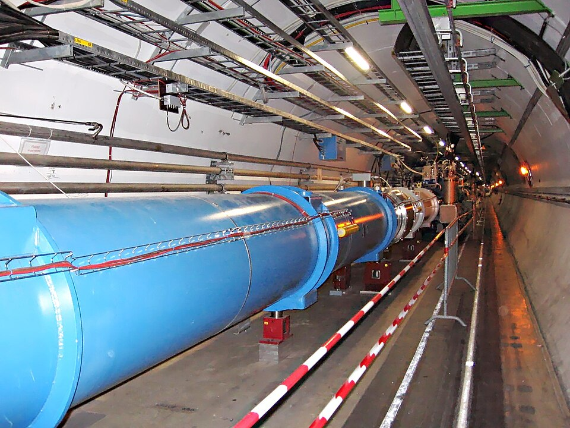
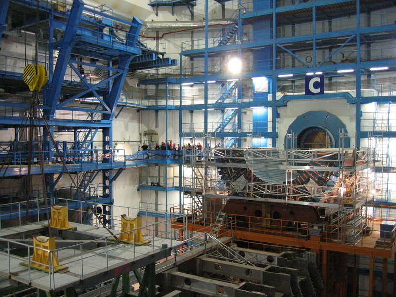
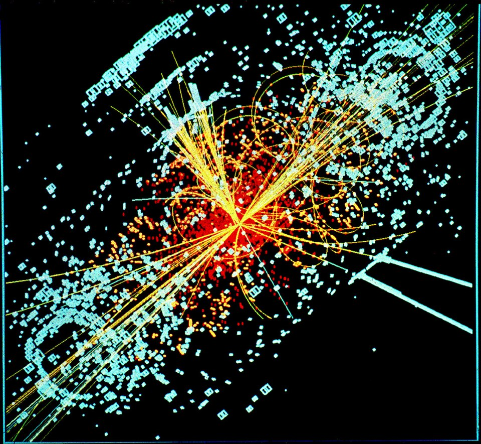

# mantissa-mlp


[](https://github.com/tekinertekin/mantissa-cnn)
[](https://github.com/tekinertekin/mantissa)

**The multilayer perceptron, with a C engine.**

An MLP classifier for tabular data (`fit` / `predict` / `predict_proba` /
`score`) built on top of
[mantissa-cnn](https://github.com/tekinertekin/mantissa-cnn): its `Dense`
layer, its [mantissa](https://github.com/tekinertekin/mantissa) C-engine and
pure-numpy backends, and its fused softmax-cross-entropy loss are all
reused, not reimplemented. This package adds what tabular classification
needs on top of that: the `(n, d)` training loop, a small cited zoo, six
tabular datasets — **two of them published by CERN**, including the ATLAS
Higgs challenge set — and the AMS physics metric the challenge was actually
scored with.

This repo is also the resolution of a cliffhanger. The family's first
package, [mantissa-perceptron](https://github.com/tekinertekin/mantissa-perceptron),
ends its concept section at Minsky & Papert's famous limit: a single neuron
draws a single line, so it can never represent XOR. The fix promised there —
a hidden layer between input and output, trained by backpropagation — is
this package. `models.xor_net()` is twelve numbers that end a
half-century-old argument.

Deliberately minimal, like the rest of the family: float32 features,
integer class ids, softmax cross-entropy (binary is the 2-class case),
plain SGD. No autograd graph, no optimizer zoo, no early stopping. Layers
allocate their scratch once per batch shape and reuse it — steady-state
training does no per-batch allocation.

## Install

```sh
pip install mantissa-mlp   # after PyPI publication
```

This pulls in `mantissa-cnn >= 0.1.0` (which pulls the engine
`mantissa-nn >= 0.2.1`).

From checkouts (works today, no PyPI needed): clone this repo, `cnn`, and
[mantissa](https://github.com/tekinertekin/mantissa) side by side, build the
engine (`make dist` there), then here:

```sh
pip install -e ../cnn && pip install -e ".[dev]"
```

mantissa-cnn finds the sibling engine checkout automatically; this package
finds mantissa-cnn's `data/` (for `mnist_flat`) and a sibling
mantissa-perceptron checkout's banknote file automatically.

## Quickstart

```sh
# datasets never download implicitly — fetch explicitly, once (~62 MB):
python -m mantissa_mlp.datasets download higgsml
python -m mantissa_mlp.datasets list
```

```python
from mantissa_mlp import models, datasets, tasks

Xtr, ytr, wtr, Xte, yte, wte = datasets.load("higgsml", weights=True)
Xtr, Xte = tasks.standardize(Xtr, Xte, missing=-999.0)   # sentinel-aware

net = models.higgs_mlp()                 # C engine; backend="numpy" also works
print(net.summary())
net.fit(Xtr, ytr, epochs=5, batch_size=32, lr=0.01, verbose=True)
print("accuracy:", net.score(Xte, yte))
print("AMS     :", tasks.ams(yte, net.predict(Xte), wte))   # the physics metric
```

And the twelve-number family story:

```python
import numpy as np
from mantissa_mlp import models

X = np.array([[0, 0], [0, 1], [1, 0], [1, 1]], dtype=np.float32)
y = np.array([0, 1, 1, 0], dtype=np.int32)
net = models.xor_net()
net.fit(X, y, epochs=500, batch_size=1, lr=0.3)   # per-pattern, as in 1986
print(net.score(X, y))                            # 1.0
```

Or compose your own:

```python
from mantissa_mlp import MLP

net = MLP(hidden=(64, 32), act="relu", classes=7, seed=0)
```

## New to MLPs? The three ideas in this package

**The hidden layer.** A single neuron computes `step(w·x + b)` — one
learned line through feature space. Minsky & Papert (*Perceptrons*, MIT
Press, 1969) made precise what that excludes: no line puts XOR's (0,0) and
(1,1) on one side and (0,1) and (1,0) on the other, and the finding froze
neural-network research for a decade. The fix is not a better line but a
layer of neurons *between* input and output: each hidden unit draws its own
line, and the output unit combines their verdicts — two half-planes AND-ed
and OR-ed into a band that XOR fits inside. Width buys expressiveness:


**Backpropagation.** Hidden layers were proposed long before anyone could
train them — the credit-assignment problem: how much of the output error is
hidden unit 3's fault? Rumelhart, Hinton & Williams (1986, "Learning
representations by back-propagating errors", *Nature* 323) gave the answer
that stuck: run the chain rule *backwards*. The forward pass computes each
layer's output; the backward pass propagates ∂loss/∂output from the top
layer down, each layer multiplying by its local derivative, so every weight
in every layer gets an exact gradient in one backward sweep that costs about
as much as the forward one. XOR is that paper's first worked example, and
`models.xor_net()` reproduces it: per-pattern updates, one hidden layer,
the whole net converging to all four corners. (This package's test suite
verifies the backward sweep against finite differences through two hidden
layers — trust, but differentiate.)

**Universal approximation.** One hidden layer is not just enough for XOR.
Cybenko (1989, "Approximation by Superpositions of a Sigmoidal Function",
*Mathematics of Control, Signals and Systems* 2(4)) proved that a single
hidden layer of sigmoidal units, wide enough, approximates any continuous
function on a compact set to any accuracy; Hornik (1991, "Approximation
capabilities of multilayer feedforward networks", *Neural Networks* 4(2))
showed it is the layered structure, not the particular activation, that
matters. That is the license behind applying one architecture family to
detector physics, forests, wine and banknotes below — and the theorem says
nothing about *finding* the weights, which is why the training loop and its
budget are what this family actually measures.

<sub>Concept diagram by Zhang, Lipton, Li & Smola, [*Dive into Deep
Learning*](https://d2l.ai), licensed
[CC BY-SA 4.0](https://creativecommons.org/licenses/by-sa/4.0/) —
redistributed here with attribution, unmodified. The same figure, source
and license as the sister repo
[mantissa-perceptron](https://github.com/tekinertekin/mantissa-perceptron)'s
concept section, where it is the promised fix; here it is the package.</sub>

## The CERN datasets: where they come from

Two of the six datasets below are not UCI classics but genuine
particle-physics data products, published by CERN on its
[Open Data portal](http://opendata.cern.ch) — one from each of the LHC's
two general-purpose experiments. They deserve their origin story.

**The machine.** The Large Hadron Collider accelerates two beams of protons
to 99.999999% of light speed around a 27 km ring under the Franco-Swiss
border and crosses them at four points, hundreds of millions of collisions
per second:



**The detectors.** At the crossing points sit cathedral-sized instruments —
ATLAS (46 m long, 7000 t) and CMS are the two general-purpose ones — that
photograph each collision's debris: silicon trackers record charged-particle
paths, calorimeters absorb and measure energy, muon chambers catch what
punches through everything else:



### higgsml — the ATLAS Higgs challenge (record 328)

After the 2012 Higgs discovery, the harder question was whether the new
boson decays to fermions as the Standard Model demands. The
H → τ⁺τ⁻ channel was the frontier: a faint signal buried under Z → ττ
decays that look nearly identical. In 2014 the ATLAS collaboration turned
that exact analysis into the **Higgs Boson Machine Learning Challenge**
(1785 teams — then Kaggle's largest), and afterwards published the full
818,238 simulated events on the CERN Open Data portal as
[record 328](http://opendata.cern.ch/record/328) (CC0, DOI
[10.7483/OPENDATA.ATLAS.ZBP2.M5T8](https://doi.org/10.7483/OPENDATA.ATLAS.ZBP2.M5T8)) —
official ATLAS simulation, the detector response and all:



- **The 30 features** come in two families, named honestly in the file:
  `PRI_*` (primitives — quantities the detector measures more or less
  directly: lepton momenta, missing transverse energy, jet four-vectors)
  and `DER_*` (derived — quantities ATLAS physicists computed *from* the
  primitives because decades of analysis say they discriminate: invariant
  masses, angular separations, centralities). Feeding both to a model asks
  it to match hand-crafted physics insight; the related deep-learning
  result of Baldi, Sadowski & Whiteson (2014, "Searching for exotic
  particles in high-energy physics with deep learning", *Nature
  Communications* 5:4308) is that deep networks can recover much of the
  `DER_*` information from primitives alone.
- **-999.0 means "does not exist", not "not measured"**: jet-dependent
  variables are undefined when the event has fewer jets than the formula
  needs (`DER_mass_jet_jet` needs two jets), and `DER_mass_MMC` is
  undefined when the mass fitter fails. The challenge documentation
  (Adam-Bourdarios et al. 2015, appendix B) fixed the sentinel at −999.0,
  outside every physical range. This package's documented handling lives in
  `tasks.standardize(missing=-999.0)`: sentinels are excluded from the
  train statistics, then imputed as 0.0 — the post-standardization mean,
  exactly neutral to a Dense layer's weighted sum.
- **AMS, not accuracy.** Unweighted, the simulation is ~⅓ signal; reality
  is not — each event carries a **weight** renormalizing simulation to
  real detector rates, where the signal is vanishingly rare. The challenge
  metric is the Approximate Median Significance,
  `AMS = sqrt(2·((s+b+10)·ln(1+s/(b+10)) − s))` with `s`,`b` the summed
  weights of selected signal and background: the median number of Gaussian
  sigmas with which the selection would establish that the signal exists.
  A high-accuracy classifier can still be a poor discovery instrument;
  `tasks.ams()` is the exact section-3 formula, and the loaders keep the
  weights renormalized per split so the numbers stay comparable to the
  challenge's own (~3.8 winning score).

### dimuon — the CMS dimuon spectrum (record 545)

The other general-purpose experiment, CMS, published a classic teaching
dataset: 100,000 real (not simulated) events from 2011 in which the
detector saw two muons, with each muon's energy, momentum vector, and
charge ([record 545](http://opendata.cern.ch/record/545), CC0; McCauley,
2017). Histogram the invariant mass of the pair and half a century of
physics appears as peaks on a falling background: the J/ψ at 3.10 GeV
(1974, charm quark), the Υ family at 9.5–10.4 GeV (1977, bottom quark),
the Z at 91 GeV (1983, electroweak unification).

The task this package builds from it: predict which resonance an event
belongs to from the muon kinematics — 16 features (E, p⃗, p_T, η, φ,
charge, per muon), 3 classes. **The labels are constructed, and honestly
so**: an event is labeled J/ψ, Υ or Z by which invariant-mass window
(2.8–3.4, 9.0–11.0, 60–120 GeV) it falls in, off-peak events are dropped,
and the mass itself is excluded from the features. Since the mass is a
closed-form function of the features (`M² = (E₁+E₂)² − |p⃗₁+p⃗₂|²`), the
task is learnable by construction — what it measures is whether a small
MLP can *approximate that nonlinear function* well enough to separate
three mass scales, which is the universal-approximation section above
made concrete on real detector data.

<sub>Photographs and event display via Wikimedia Commons, licenses
verified on each file page: LHC tunnel by
[Julian Herzog](https://commons.wikimedia.org/wiki/File:CERN_LHC_Tunnel1.jpg),
[CC BY-SA 3.0](https://creativecommons.org/licenses/by-sa/3.0/), scaled to
960 px; ATLAS cavern by
[Nikolai Schwerg](https://commons.wikimedia.org/wiki/File:CERN_Atlas_Caverne.jpg),
[CC BY-SA 3.0](https://creativecommons.org/licenses/by-sa/3.0/), unmodified;
simulated CMS Higgs event by
[Lucas Taylor / CERN](https://commons.wikimedia.org/wiki/File:CMS_Higgs-event.jpg),
[CC BY-SA 3.0](https://creativecommons.org/licenses/by-sa/3.0/), scaled to
960 px — all redistributed here with attribution.</sub>

<sub>Papers: Adam-Bourdarios, Cowan, Germain, Guyon, Kégl & Rousseau
(2015), "The Higgs boson machine learning challenge", *JMLR W&CP* 42;
ATLAS Collaboration (2014), dataset DOI
[10.7483/OPENDATA.ATLAS.ZBP2.M5T8](https://doi.org/10.7483/OPENDATA.ATLAS.ZBP2.M5T8);
McCauley (2017), CERN Open Data record 545; Baldi, Sadowski & Whiteson
(2014), *Nature Communications* 5:4308.</sub>

## Model zoo

Honest names: cited recipes at this package's scale, deviations flagged in
each docstring.

| model | architecture | paper |
|-------|--------------|-------|
| `xor_net` | 2 → 2 tanh → 2 logits — the minimal hidden-layer net; the paper's 2-2-1 with the family's softmax head instead of one sigmoid unit (flagged), per-pattern training recipe in the docstring | Rumelhart, Hinton & Williams (1986), "Learning representations by back-propagating errors", *Nature* 323; Cybenko (1989), *MCSS* 2(4) |
| `tabular_mlp` | d → 64 → 32 → classes, relu — the generic workhorse | Rumelhart, Hinton & Williams (1986); the default shape is the modern textbook baseline (Goodfellow, Bengio & Courville, 2016, ch. 6) |
| `higgs_mlp` | 30 → 300 → 200 → 100 → 2, relu — 600 hidden units in the spirit of the HiggsML winners' nets; no ensemble, no momentum/dropout (flagged) | Adam-Bourdarios et al. (2015), "The Higgs boson machine learning challenge", *JMLR W&CP* 42 |

## Datasets

Six tabular classification sets. **Nothing downloads implicitly** —
`data/` is gitignored and library code never touches the network; missing
files raise with the exact fix command:

```sh
python -m mantissa_mlp.datasets download <name|all>
python -m mantissa_mlp.datasets list
```

| name | train/test | d | classes | task | source |
|------|------------|---|---------|------|--------|
| higgsml | 250k / 550k | 30 | 2 | Higgs → ττ signal vs background (simulated ATLAS, physics weights for AMS) | CERN Open Data [328](http://opendata.cern.ch/record/328), CC0, DOI [10.7483/OPENDATA.ATLAS.ZBP2.M5T8](https://doi.org/10.7483/OPENDATA.ATLAS.ZBP2.M5T8) |
| dimuon | 70/30 of ~72k | 16 | 3 | J/ψ vs Υ vs Z from muon kinematics (mass-window labels, real CMS events) | CERN Open Data [545](http://opendata.cern.ch/record/545), CC0 (McCauley, 2017) |
| mnist_flat | 60k / 10k | 784 | 10 | digits, flattened to rows — the family's mnist via mantissa-cnn, one download shared | LeCun, Bottou, Bengio & Haffner (1998) |
| covertype | 75/25 of 581k | 54 | 7 | forest cover type from cartographic features | UCI covtype (Blackard & Dean, 1999) |
| wine_quality | 75/25 of 6.5k | 11 | 3 | red+white vinho verde; expert score binned ≤5 / 6 / ≥7 (documented, not canonical) | UCI (Cortez, Cerdeira, Almeida, Matos & Reis, 2009) |
| banknote | 75/25 of 1372 | 4 | 2 | genuine vs forged — the perceptron repo's protocol dataset, kept as the family-continuity sanity row | UCI 00267 |

`datasets.load(name)` → `(X_train, y_train, X_test, y_test)`, float32
features (unstandardized — standardization is a train-statistics decision;
see `tasks.standardize`), int32 labels. higgsml carries its physics event
weights: `load("higgsml", weights=True)` returns them renormalized per
split. `datasets.subset(name, n_train, n_test, seed)` gives seeded
stratified subsets (the benchmark protocol below uses 4000/2000 and
2000/1000). Splits: higgsml uses the challenge's own `KaggleSet` column;
mnist_flat keeps the official files; the rest take the family protocol
(stratified 75/25, seed 42).

## Results

<!-- BEGIN:BENCH (bench/protocol.py is frozen; the measured tables land here
when the harness phase runs — do not edit outside these markers) -->
Protocol, fixed in `bench/protocol.py` **before** any benchmark code exists
(the family rule: numbers cannot be tuned after the fact): the **same
architecture re-expressed in each framework** — `torch.nn.Sequential`
eager, `tf.keras.Sequential`, scikit-learn `MLPClassifier`, our `MLP` —
with identical hyperparameters everywhere: plain SGD, lr 0.01, batch 32,
5 epochs, seed 0. scikit-learn **is** a full contender in this repo —
`MLPClassifier` is a real MLP (pinned to `solver="sgd"`, constant learning
rate, momentum 0 to match everyone else) — unlike in mantissa-cnn's
benchmark, where it could not express a convolution and was excluded.

Datasets: seeded stratified subsets — 4000 train / 2000 test for the two
big sets (higgsml, covertype), 2000 / 1000 for dimuon, mnist_flat and
wine_quality, 1000 / 300 for banknote (the whole set is 1372 rows).
Features standardized on train statistics only (`missing=-999.0` for
higgsml). Metrics per (dataset, contender): fit wall-time (median of 5
interleaved repeats), test accuracy, **AMS with renormalized weights for
higgsml** — the physics column, reported alongside accuracy because they
deliberately disagree — and peak RSS in a fresh subprocess, import cost
included.

*The harness has not run yet; this section carries the frozen protocol so
the tables that land here cannot move the goalposts. Measured so far
(v0.1.0 smoke, not the protocol): see CHANGELOG.*
<!-- END:BENCH -->

### Methodology

Identical architectures, subsets, epochs, batch size, learning rate and
seeds for every contender; timings are medians over interleaved repeats on
one machine, library versions recorded in the results JSON. Peak RSS is
measured per contender in a fresh subprocess because that is what a user
pays. *Measure, don't assume.*

## License

MIT — © Tekin Ertekin. Base package:
[mantissa-cnn](https://github.com/tekinertekin/mantissa-cnn); engine:
[mantissa](https://github.com/tekinertekin/mantissa) — same author, MIT.
The CERN figures and datasets carry their own licenses, credited above:
the two Open Data records are CC0, the three photographs CC BY-SA 3.0,
the concept diagram CC BY-SA 4.0.
